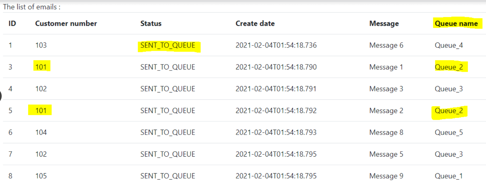

# emails-management
Solution to manage the scheduling of emails sending

#BackEnd : 
* Spring boot, Spring Mvc, Spring DATA, Hibernate, HQL, H2
#FrontEnd : 
* HTML, Tyhmeleaf

# Functional need:
* Send emails to customers
* An email table (id, create_date, customer_number, message, status)
* A customer can have several emails (10)
* The Customer receives the email in the order of creation in the system

#URL
* Url **view-list** : show the list of all messages
http://localhost:8080/all-view

* Url **Add** list message (10 messages)
http://localhost:8080/add-emails

* Url  **send** : Simulate the sending, change the status, put the message on the correct "Queue"
http://localhost:8080/send

* http://localhost:8080/view/TO_SEND
* http://localhost:8080/view/SENT_TO_QUEUE
* http://localhost:8080/view/SENT_TO_CUSTOMER

